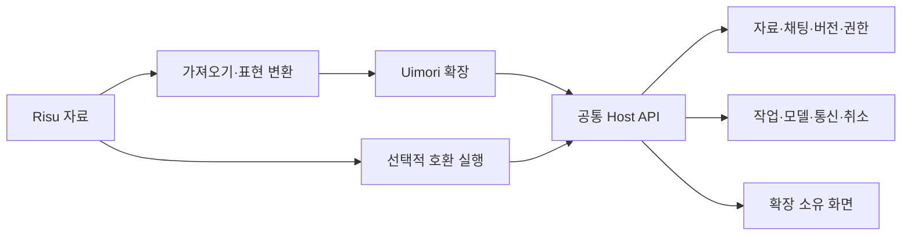

# 확장 실행 경계 · 설계 초안

상태: 공통 경계와 후속 확장 설계예요. 현재 구현된 화면과 상태 계산 코드의 계약은 각각 [커스텀 패널](PACKAGE-PANELS.md)과 [상태 계산 코드](EXTENSION-PROGRAMS.md)가 소유해요. 확장 설치·자동 hook·비동기 broker 전체의 완료 문서는 아니에요. 제품 원칙은 [베타 결정](DECISIONS-2026-09-12-BETA.md), 진행과 표본 근거는 [베타 계획](../project-plan/BETA-PLAN.md) · [표본 기준](../project-plan/BETA-SAMPLES.md)이 소유해요.

2026-09-13 첫 화면 경계는 [커스텀 패널](PACKAGE-PANELS.md)로 구현했어요. 현재 상태/옵션에서 읽기 전용 HTML을 만들고, 격리된 패널의 실제 사용자 행동만 기존 상태 API로 전달해요. 사용자·모델 행동의 JavaScript 상태 계산을 별도 Worker/고정 크기 QuickJS WASM과 기존 저장 경계에 연결했어요. 모델 행동은 공통 async 경로에서 계산하고 성공 원문 저장 때만 현재 상태에 게시해요. Lua·제공자 어댑터와 비동기 host broker는 후속 범위예요. 아래 before-request 제안을 이미 지원하는 SDK로 읽지 않아요.

작업 순서는 [베타 계획의 6단계](../project-plan/BETA-PLAN.md)를 따라요. 현재 2~3단계에서 표본은 공통 계약의 요구를 확인하는 용도예요. 선언형 구성은 정적인 옵션·제한된 계산·일반적인 레코드 읽기에 사용하고, 복잡한 알고리즘은 확장 코드가 맡도록 설계해요. 표본의 함수마다 본체 분기나 선언 필드를 추가하는 방식으로 임의 코드 실행 기반을 대체하지 않아요. 향후 코드 실행기의 결과에도 같은 소유권·상태 schema·개정/원문 검사·원자적 효과 적용 경계가 필요해요.

## 책임 경계

본체는 외부 자료의 내부 DB·함수 이름·화면 구조를 알지 않고 Uimori의 계약을 유지해요. 호환 실행은 지원하는 입력 계약을 공통 API에 연결하며, 호환 확장을 제거해도 Uimori 자체의 제작·채팅·백업이 가능해야 해요. 해당 확장에 의존하는 자료의 기능까지 계속 실행된다는 뜻은 아니에요.

| 책임 | 호스트가 보장할 경계 | 확장이 맡을 자율 동작 |
| --- | --- | --- |
| 데이터 | 자료/채팅/분기/실행 범위, 버전·변경 충돌·출처, 보관/복원 | 필요한 자료 선택, 자체 설정·상태 계산과 표현 |
| 실행 | 호출자·코드·권한·입력의 고정, 실행 취소와 자원 관리 | 계산·파싱·조건·여러 단계의 작업 구성 |
| 모델·통신 | 허용된 연결과 외부 대상, 전송 전 기록, 작업 결과·불확실 실행 처리 | 제공자 요청/응답 어댑터, 모델 선택 규칙·외부 도구 연계 |
| 원문 | 생성 원본과 수정 이력, 변경의 귀속·사용자 통제 | 허가된 입력/응답 가공과 변경 제안·적용 |
| 화면 | 확장 소유 영역과 메시지 통로, 공통 테마·알림 수단 | 상태창·선택기·게시판·편집기·공유 문서 |
| 실패 | 본문과 부가 작업의 수명 분리, 오류·늦은 결과·복구 | 자신의 실패 처리와 정상 범위 안의 수정 시도 |

## 권한과 의존성

실행 권한은 자료 안의 지시문이나 함수 이름으로 늘어나지 않아요. 설치한 코드와 의존성, 사용자가 허용한 작업·자료·연결 범위로 결정하고 실제 효과를 적용할 때 다시 확인해요. 확장에는 호스트 객체나 DB 연결을 직접 넘기지 않고 검증 가능한 값과 명령 결과를 교환해요.

의존성을 통해 실행되는 코드도 설치·권한 판단에 포함해요. 상위 확장이 하위 자료의 코드를 불러온다고 그 코드가 검토 없이 상위 권한을 얻도록 하지 않아요. 권한과 실행 주체를 추적할 수 없는 동적 로딩은 지원되지 않는 범위로 판정해야 해요. 가져오기에서 lore에 들어 있는 실행 코드와 모델용 참고 문장을 구분하는 것도 이 계약의 일부예요.

인증은 호스트의 허가된 연결 사용을 기본으로 하고 비밀키·환경변수·다른 자료를 코드에 통째로 전달하지 않아요. 신규 권한이나 외부 전송 범위가 필요한 업데이트는 기존 승인에 조용히 합치지 않아요. 원문 보존·정보 공유 제한을 부가 기능의 실패 시 우회하는 fallback을 만들지 않아요.

내부 operation 영수증과 공유용 진단도 구분해요. 게스트가 고른 operation ID·오류 문장·결과 hash는 그 자체로 안전한 진단 값이 아니에요. 실제 공유 보고서는 [진단 계약](DIAGNOSTICS.md)처럼 호스트가 만든 별칭·허용 enum·수량으로 투영하고 원문과 임의 식별자를 제외해야 해요. 합성 실험에 사용하는 고정 ID·hash를 제품의 공개 로그 규칙으로 그대로 옮기지 않아요.

## 실행과 상태

정상 준비는 기다리되 사용자가 건너뛸 수 있고, 실패한 부가 기능은 본문 실행을 거부하는 권한을 갖지 않아요. 실제 본문 모델·데이터 저장 자체의 실패는 별도로 표시해요. 모든 예외를 무조건 성공으로 바꾸거나 본문을 보내기 위해 사용자의 입력을 조용히 잘라내지 않아요.

본문에서 참고하는 마지막 유효 상태와 다음 상태 계산에 필요한 정확한 부모 상태를 구분해요. 뒤처진 상태를 최신 상태로 표시하지 않으며, 원래 source/hash/분기에 속한 늦은 결과가 이후 사용자 작업이나 이미 예약한 입력을 덮어쓰지 않도록 해요. 재시도는 필요한 부가 작업만 대상으로 하고 성공한 효과·난수·본문을 반복하지 않아요.

확장 간 충돌은 공통 저장·실행 경계에서 검출하고, 사용자가 선택한 합성 가능한 동작과 충돌하는 변경을 구분해요. 특정 자료 이름의 우선순위를 본체에 하드코딩하지 않아요. 정확한 충돌 해결·순서 표현은 대표 동작 검증에서 결정해요.

## 코드와 화면의 격리 후보

현재 기술 검토의 결론은 호스트의 JavaScript 객체를 직접 공유하는 실행을 피하고, 제한된 실행 엔진과 메시지 기반 Host API를 검증하는 방향이에요. 언어와 실행 엔진은 Uimori API 계약에서 분리해요. JS/Lua 호환 실행과 네이티브 확장이 같은 상태·작업 경계를 사용할 수 있어야 해요.

- Node의 `vm`은 보안 경계가 아니고 Permission Model도 악의적인 코드의 격리를 보장하지 않아요. 이것만으로 외부 확장을 호스트에서 실행하는 구현은 채택하지 않아요. [Node 24 VM](https://nodejs.org/docs/latest-v24.x/api/vm.html), [Node 24 permissions](https://nodejs.org/docs/latest-v24.x/api/permissions.html)
- QuickJS의 WebAssembly 실행과 명시적인 호스트 함수 연결은 JS 후보예요. 런타임의 CPU·메모리 제한을 사용할 수 있지만 바인딩 자체가 보안 감사를 받았다고 보장되지는 않아요. 기능·취소·메모리·비정상 입력·호스트 참조 노출을 검증하기 전 운영 격리 완료로 표시하지 않아요. [QuickJS bindings](https://github.com/justjake/quickjs-emscripten)
- 실행 엔진의 제한과 프로세스/운영체제의 가용성 격리를 별도로 검토해요. 새 런타임·배포 의존성을 채택할 때 실제 Linux/Docker 경로와 개발 환경에서 검증하고 라이선스·버전을 기록해요.
- 화면은 주 앱 DOM 전체 접근을 제공하지 않고 독립된 소유 영역과 호스트 메시지 API로 연결해요. 공통 테마·진행 표시 같은 기능은 명시적인 UI API로 표현해요. 정확한 렌더러·CSP·통신 설정은 실제 구현과 함께 검증해요.

이 후보 검토는 특정 엔진을 사용자 확정 선택으로 만드는 결정이 아니에요. 첫 순수 상태 계산에는 WASM 선형 메모리를 별도로 고정한 QuickJS를 채택했으며, 내부 allocator 한도와 Worker의 전체 RSS 제한을 혼동하지 않아요. 모델/통신 등 추가 권한의 실행 환경까지 확정한 것은 아니에요.

2026-09-12 후보 검증에서는 QuickJS 자체의 heap-limit 기대를 충족하지 못한 사례를 확인했어요. 별도의 Linux Docker 합성 실험에서는 실제 cgroup OOM 종료와 새 컨테이너의 정상 실행을 확인했어요. 두 결과를 합쳐 엔진의 격리가 완성됐다고 판단하지 않아요. 정확한 성공·실패·미실행 구분과 근거는 [베타 기록](../project-plan/BETA-PLAN.md)에 있어요.

## 첫 host 흐름의 구현 제안

아래는 다음 구현을 위한 초안이며 현재 앱에 설치 가능한 SDK가 아니에요. 기존 상태 대기를 마친 같은 Run의 `running` 단계에서, 본문 문맥 준비 직전에 비동기 확장 준비를 수행하는 방향이에요. `waiting_for_state`를 모든 확장 작업으로 재해석하거나 state job을 복제하지 않아요. 예약 transaction에서는 코드·API·엔진·해석한 의존성 hash·권한 상한·소유 상태 개정만 고정하고 외부 호출은 그 밖에서 진행해요.

게스트에는 원래 snapshot·원문·상태·권한 객체를 통째로 먼저 넘기지 않아요. 읽기·모델/HTTP 요청·상태/화면 준비는 별도 broker가 invocation에 결합한 범위와 현재 권한으로 판단해요. 메시지 안의 chat/branch/instance/grant/generation 값은 호출자의 권한 증거가 아니에요. 엔진 쪽의 JSON 검사와 별개로 broker도 프레임 크기·구조·예산·operation 중복을 검증해야 해요.

원래 `runs.request`와 `snapshot.request`는 유지하고 가공입력을 별도로 확정해요. 결과 도착 순서가 아닌 선언 순서·입력 hash·invocation 귀속으로 채택하고, 그 후 같은 고정 자료·이력으로 문맥 예산과 프롬프트를 계산해요. 건너뛰기는 준비 결과의 채택을 닫는 동작이에요. 늦은 결과는 영수증과 사용량으로 남기되 확정 입력·현재 상태·화면을 덮어쓰지 않아요.

첫 before-request 흐름의 상태 쓰기는 proposal로 준비하고 성공 원문 저장 때 개정·source CAS와 권한이 여전히 맞는 효과만 게시하는 것을 권해요. 부가 스키마/CAS 실패는 효과를 실패시키고 본문은 보존하며 실제 DB 실패는 전파해요. 사용자 UI 행동의 즉시 저장은 별도 hook 계약으로 다루며 이것을 모든 확장 상태의 영구 정책으로 확정하지 않아요.

## 메시지와 복원 metadata의 제안

복잡한 자료에는 과거 사용자 메시지에 기록한 판정 수정과, 메시지의 숨은 참조에서 자체 저장 상태를 복원하는 기능이 있어요. 원본 요청을 UPDATE하거나 주석을 지우는 것만으로 옮길 수 없어요. 현재 `source_edits`는 assistant Source 전용이고 그 Source를 공유하는 분기에 함께 적용돼요. 분기별 메시지 수정으로 광고하며 그대로 호출하지 않아요.

- 안정적인 메시지 참조는 request의 Run ID 또는 assistant의 Source ID를 사용해요. 호환 배열의 위치는 조회 때 참조·hash에 결합하고 비동기 UI 뒤에 재검사해요.
- 분기별 overlay는 원래 요청/원문과 별도로 개정·출처·표시/모델 문맥 범위를 기록하는 후보예요. 실제 Source 전체 수정은 별도 강한 권한과 기존 범위를 유지해요.
- 모델 문맥에 반영하는 사용자 메시지 overlay에는 별도의 effective-message hash가 필요해요. 화면만 고치고 과거 판정의 요약을 그대로 재사용하지 않도록 새 Run·조회·요약이 같은 view 의존성을 고정해야 해요. 원문 근거용 contentHash는 바꾸지 않아요.
- 판정 수정·자원 소비·metadata 연결은 한 효과 묶음과 operation 영수증으로 처리해요. 권한을 일반 문자열이나 HTML 주석에서 얻지 않아요. 호환 코드에 필요한 주석은 확장 소유 metadata에서 가상 표현으로 구성할 수 있어요.
- checkpoint는 같은 인스턴스·허가된 분기·메시지/hash·코드/상태 개정에 결합해요. 정리는 화면의 현재 노출 여부 대신 과거 Run·분기·metadata의 실제 참조를 기준으로 판단해야 해요.

이 원칙으로 판정 정정을 이후 진행에 반영하면서 과거 원고와 실행을 보존하는 경로를 먼저 검증해요. 과거 장면까지 다시 쓰는 생성은 판정 버튼의 숨은 부수 효과로 추가하지 않아요. 구체적인 이식 경험이 원본과 달라지는 경우에는 동작을 보여 주고 사용자와 판단해요.

## 대표 검증

1. 추가 모델 결과를 해석해 상태와 화면을 갱신하는 흐름을 공통 작업 API로 연결해요. 입력·출력·검증·수정·재시도 각각의 귀속을 확인해요.
2. 독립된 확장이 제공자 요청·외부 도구와 연계해도 비밀·자료 범위를 넘어가지 않고 취소와 실패를 전달하는지 확인해요.
3. 창작 요청과 복잡한 모듈을 함께 사용하면서 정상 대기·건너뛰기·부가 실패·동시 채팅·늦은 결과를 검증해요.
4. 권한 없는 접근·잘못된 호출·무한 계산·과도한 출력·의존성 권한 전달·취소 후 호출을 합성 코드로 확인해요. 테스트 통과를 모든 공격에 대한 보증으로 해석하지 않아요.
5. 자료·코드·설정·상태의 백업과 이동 뒤 같은 경계를 유지하는지 확인해요. 원본 표본의 실제 기능 인수는 별도예요.

실제 지원은 [상태 계산 코드](EXTENSION-PROGRAMS.md)와 [베타 실행 기록](../project-plan/BETA-PLAN.md)의 구현·검증 결과로 판정해요. 현재 사용자 행동의 코드 실행을 before-request·모델/통신·확장 설치 전체의 지원으로 넓혀 해석하지 않아요.
