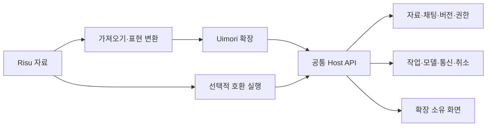

# 확장 실행 경계 · 설계 초안

상태: 공통 경계 검토 중이며 확장 설치·임의 코드 실행 API의 구현 완료 문서가 아니에요. 제품 원칙은 [베타 결정](DECISIONS-2026-09-12-BETA.md), 진행과 표본 근거는 [베타 계획](../project-plan/BETA-PLAN.md) · [표본 기준](../project-plan/BETA-SAMPLES.md)이 소유해요. 이 문서의 세부 설계는 대표 동작과 실패 사례를 검증하며 조정해요.

## 책임 경계

본체는 외부 자료의 내부 DB·함수 이름·화면 구조를 알지 않고 Uimori의 계약을 유지해요. 호환 실행은 지원하는 입력 계약을 공통 API에 연결하며, 호환 확장을 제거해도 Uimori 자체의 제작·채팅·백업이 가능해야 해요. 해당 확장에 의존하는 자료의 기능까지 계속 실행된다는 뜻은 아니에요.

| 책임 | 호스트가 보장할 경계 | 확장이 맡을 자율 동작 |
| --- | --- | --- |
| 데이터 | 자료/채팅/분기/실행 범위, 버전·변경 충돌·출처, 보관/복원 | 필요한 자료 선택, 자체 설정·상태 계산과 표현 |
| 실행 | 호출자·코드·권한·입력의 고정, 실행 취소와 자원 관리 | 계산·파싱·조건·여러 단계의 작업 구성 |
| 모델·통신 | 허용된 연결과 외부 대상, 전송 전 기록, 작업 결과·불확실 실행 처리 | 제공자 요청/응답 어댑터, 모델 선택 규칙·외부 도구 연계 |
| 원문 | 생성 원본과 수정 이력, 변경의 귀속·사용자 통제 | 허가된 입력/응답 가공과 변경 제안·적용 |
| 화면 | 확장 소유 영역과 메시지 통로, 공통 테마·알림 수단 | 상태창·선택기·게시판·편집기·공유 문서 |
| 실패 | 본문과 부가 작업의 수명 분리, 오류·늦은 결과·복구 | 자신의 실패 처리와 정상 범위 안의 수정 시도 |

## 권한과 의존성

실행 권한은 자료 안의 지시문이나 함수 이름으로 늘어나지 않아요. 설치한 코드와 의존성, 사용자가 허용한 작업·자료·연결 범위로 결정하고 실제 효과를 적용할 때 다시 확인해요. 확장에는 호스트 객체나 DB 연결을 직접 넘기지 않고 검증 가능한 값과 명령 결과를 교환해요.

의존성을 통해 실행되는 코드도 설치·권한 판단에 포함해요. 상위 확장이 하위 자료의 코드를 불러온다고 그 코드가 검토 없이 상위 권한을 얻도록 하지 않아요. 권한과 실행 주체를 추적할 수 없는 동적 로딩은 지원되지 않는 범위로 판정해야 해요. 가져오기에서 lore에 들어 있는 실행 코드와 모델용 참고 문장을 구분하는 것도 이 계약의 일부예요.

인증은 호스트의 허가된 연결 사용을 기본으로 하고 비밀키·환경변수·다른 자료를 코드에 통째로 전달하지 않아요. 신규 권한이나 외부 전송 범위가 필요한 업데이트는 기존 승인에 조용히 합치지 않아요. 원문 보존·정보 공유 제한을 부가 기능의 실패 시 우회하는 fallback을 만들지 않아요.

## 실행과 상태

정상 준비는 기다리되 사용자가 건너뛸 수 있고, 실패한 부가 기능은 본문 실행을 거부하는 권한을 갖지 않아요. 실제 본문 모델·데이터 저장 자체의 실패는 별도로 표시해요. 모든 예외를 무조건 성공으로 바꾸거나 본문을 보내기 위해 사용자의 입력을 조용히 잘라내지 않아요.

본문에서 참고하는 마지막 유효 상태와 다음 상태 계산에 필요한 정확한 부모 상태를 구분해요. 뒤처진 상태를 최신 상태로 표시하지 않으며, 원래 source/hash/분기에 속한 늦은 결과가 이후 사용자 작업이나 이미 예약한 입력을 덮어쓰지 않도록 해요. 재시도는 필요한 부가 작업만 대상으로 하고 성공한 효과·난수·본문을 반복하지 않아요.

확장 간 충돌은 공통 저장·실행 경계에서 검출하고, 사용자가 선택한 합성 가능한 동작과 충돌하는 변경을 구분해요. 특정 자료 이름의 우선순위를 본체에 하드코딩하지 않아요. 정확한 충돌 해결·순서 표현은 대표 동작 검증에서 결정해요.

## 코드와 화면의 격리 후보

현재 기술 검토의 결론은 호스트의 JavaScript 객체를 직접 공유하는 실행을 피하고, 제한된 실행 엔진과 메시지 기반 Host API를 검증하는 방향이에요. 언어와 실행 엔진은 Uimori API 계약에서 분리해요. JS/Lua 호환 실행과 네이티브 확장이 같은 상태·작업 경계를 사용할 수 있어야 해요.

- Node의 `vm`은 보안 경계가 아니고 Permission Model도 악의적인 코드의 격리를 보장하지 않아요. 이것만으로 외부 확장을 호스트에서 실행하는 구현은 채택하지 않아요. [Node 24 VM](https://nodejs.org/docs/latest-v24.x/api/vm.html), [Node 24 permissions](https://nodejs.org/docs/latest-v24.x/api/permissions.html)
- QuickJS의 WebAssembly 실행과 명시적인 호스트 함수 연결은 JS 후보예요. 런타임의 CPU·메모리 제한을 사용할 수 있지만 바인딩 자체가 보안 감사를 받았다고 보장되지는 않아요. 기능·취소·메모리·비정상 입력·호스트 참조 노출을 검증하기 전 운영 격리 완료로 표시하지 않아요. [QuickJS bindings](https://github.com/justjake/quickjs-emscripten)
- 실행 엔진의 제한과 프로세스/운영체제의 가용성 격리를 별도로 검토해요. 새 런타임·배포 의존성을 채택할 때 실제 Linux/Docker 경로와 개발 환경에서 검증하고 라이선스·버전을 기록해요.
- 화면은 주 앱 DOM 전체 접근을 제공하지 않고 독립된 소유 영역과 호스트 메시지 API로 연결해요. 공통 테마·진행 표시 같은 기능은 명시적인 UI API로 표현해요. 정확한 렌더러·CSP·통신 설정은 실제 구현과 함께 검증해요.

이 후보 검토는 특정 엔진을 사용자 확정 선택으로 만드는 결정이 아니에요. 위의 경계가 실제로 지켜지는지와 표본 기능을 표현할 수 있는지를 함께 확인한 뒤 구현자가 선택해요.

## 대표 검증

1. 추가 모델 결과를 해석해 상태와 화면을 갱신하는 흐름을 공통 작업 API로 연결해요. 입력·출력·검증·수정·재시도 각각의 귀속을 확인해요.
2. 독립된 확장이 제공자 요청·외부 도구와 연계해도 비밀·자료 범위를 넘어가지 않고 취소와 실패를 전달하는지 확인해요.
3. 창작 요청과 복잡한 모듈을 함께 사용하면서 정상 대기·건너뛰기·부가 실패·동시 채팅·늦은 결과를 검증해요.
4. 권한 없는 접근·잘못된 호출·무한 계산·과도한 출력·의존성 권한 전달·취소 후 호출을 합성 코드로 확인해요. 테스트 통과를 모든 공격에 대한 보증으로 해석하지 않아요.
5. 자료·코드·설정·상태의 백업과 이동 뒤 같은 경계를 유지하는지 확인해요. 원본 표본의 실제 기능 인수는 별도예요.

첫 구현에서는 기존 상태 준비/실패와 migration 경계를 먼저 보완하고 있어요. 임의 코드 실행과 확장 설치의 실제 지원은 이 문서가 아니라 [베타 실행 기록](../project-plan/BETA-PLAN.md)의 구현·검증 결과로 판정해요.
